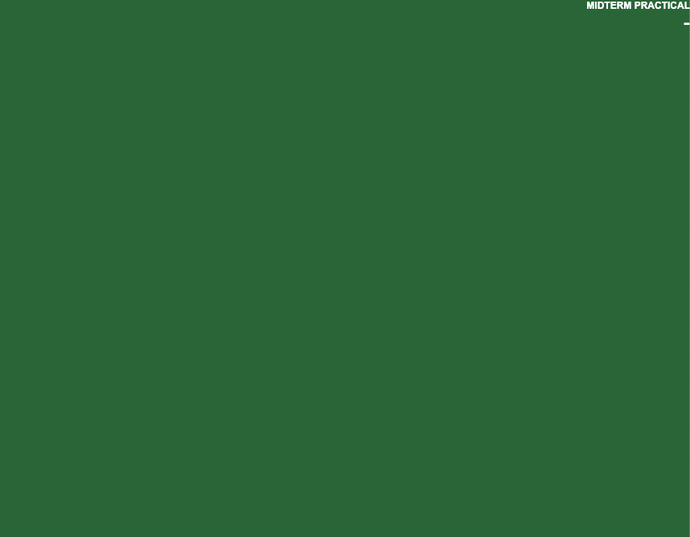
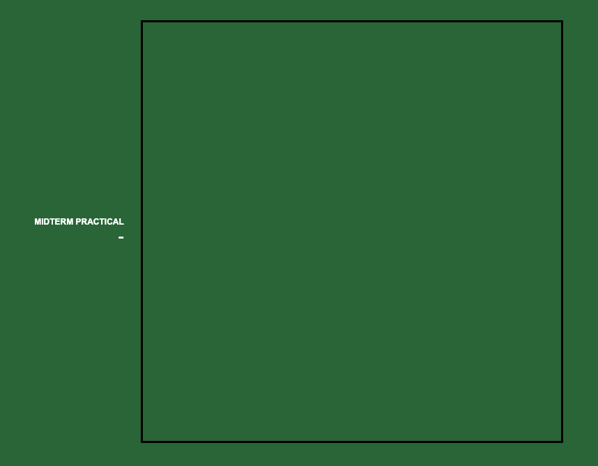
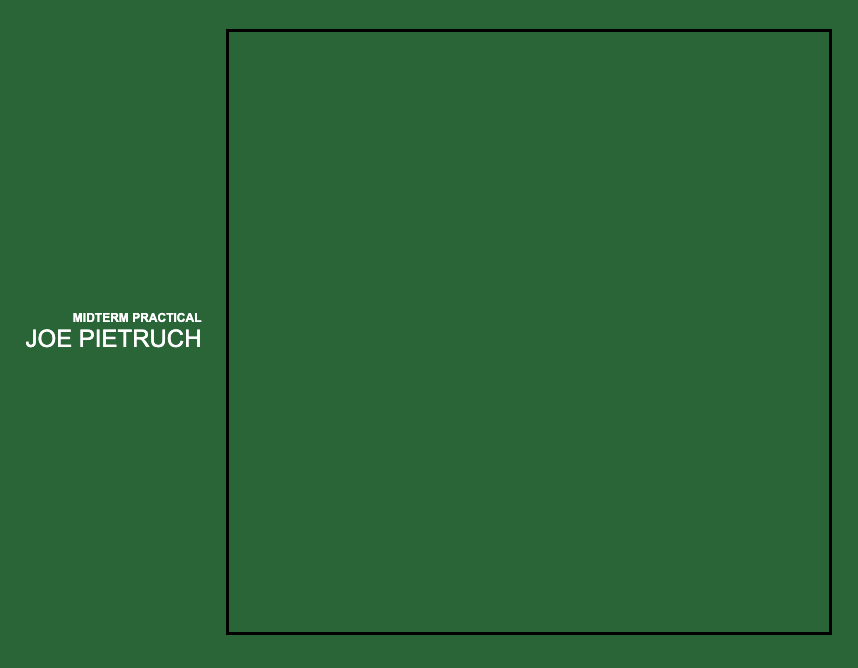
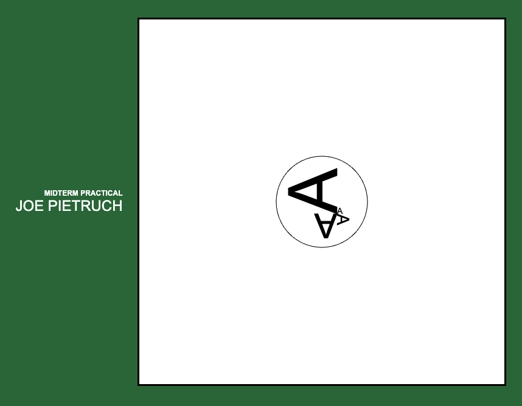
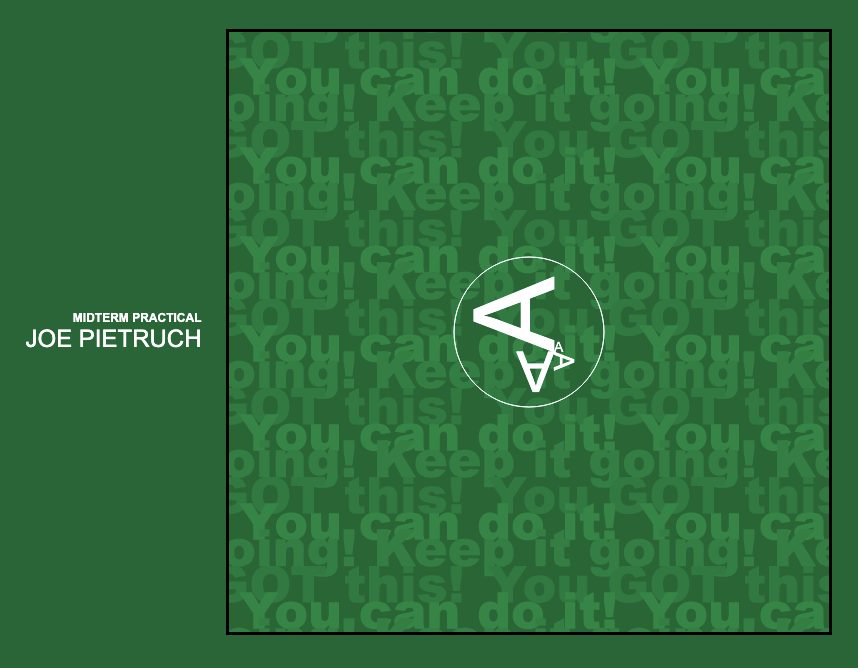
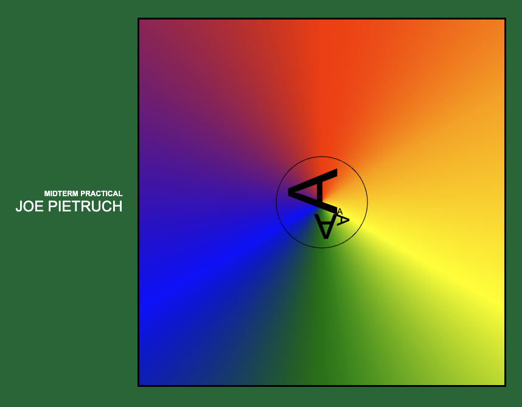
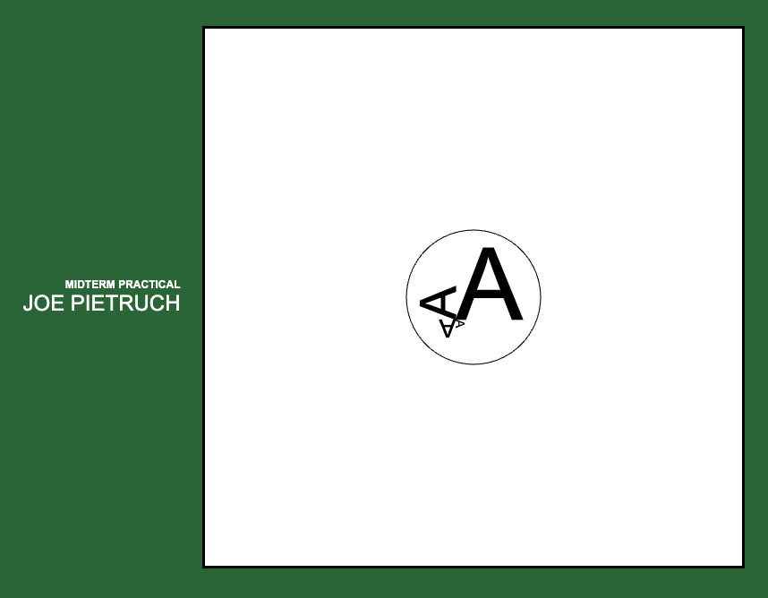

# Midterm Practical : Canvas

Your goal is to use HTML, CSS, and JS/TS to demonstrate some of what we've learned in the first half of the course. Follow the steps below, and then commit and push your work. (Before you log out, be sure to check with me that your work has made it to github.com!)

## Recommended Steps

#### 0 - Initial Setup

Perform the steps we are getting used to for every repository setup. (Except you don't have to worry about test commands, as there are none for the exam.)

 <i>Hint: Initial Setup</i> 

1. Clone the Repo
2. Open GitBash at the repo root folder.
3. Run `npm install`
4. ~~Run `npm run test:install`~~ - no tests
5. Run `npm start`
6. ~~(In a new GitBash window) Run `npm run test:unit`~~ - no tests
7. ~~(In a new GitBash window) Run `npm run test:e2e`~~ - no tests
8. Open the project in VS Code
9. Open the browser to http://localhost:5173

  

#### 1 - Starting Point

Here's where we're starting from:

#### 2 - Page Layout

Add a `<canvas>` to `index.html`, set its width and height to 600 in `main.ts`.

Edit `styles.css` to use flexbox on the body element for the page layout. I used a `gap` of `24px`.

This is what the finished layout looks like:

#### 3 - Sign Your Name

In `main.ts`, write some code to set the inner text of the `
` element to your name.

This is what the step would look like if your name were Joe Pietruch:

#### 4 - Draw the Canvas

In `main.ts`, write some code to draw to the canvas.

The circle has a radius of 75 pixels, and is centered in the canvas. The line is 1 pixel wide.

The text is 'Arial' and is sized at 14px, 28px, 56px, and 112px. It is off-center by an extra 25px right and 20px down. Remember, `90` degrees is `Math.PI / 2` radians - and canvas uses radians.

This is what the finished drawing looks like:

#### 5 - Options

To get the rest of the credit, complete ONE of the following options. (You're welcome to go for two (+1) or three (+2) as bonus points ... just make sure you get one working solid, first!)

##### 5A - Pattern

Use the provided `src/assets/pattern.png` to create a pattern fill for the canvas. Notice how the drawing also changed from black to white. This is what the finished pattern looks like:

##### 5B - Gradient

Create a gradient background for the canvas. The color values I used were:

- 0.000 : 'red'
- 0.166 : 'orange'
- 0.333 : 'yellow'
- 0.500 : 'green'
- 0.666 : 'blue'
- 0.833 : 'purple'
- 1.000 : 'red'

This is what the finished gradient looks like:

##### 5C - Click to Rotate

Add a click event handler to the canvas, such that clicking causes a CSS transform that rotates the element 90deg. Also add a CSS transition so that rotation happens over time. This is what the finished rotate looks like:

